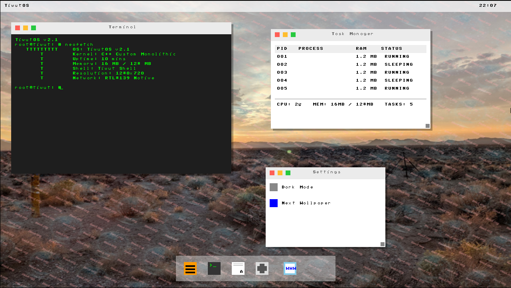

# TiwutOS
A custom, bare-metal operating system built entirely from scratch in C++ and Assembly. TiwutOS started as a simple "Hello World" kernel and has rapidly evolved into a fully graphical, network-capable environment.



## Current Status
- **"Hello World" Bootloader** -> Successful
- **Graphical Window Interface** -> Successful
- **Custom Networking Stack** -> Successful
- **Rust Kernel Integration** -> In Development

---

## What's New in v2.1!
Version 2.1 is a massive architectural leap. The OS was evolved from a basic UI into a fully functional graphical environment with its own native network stack and window management system.

### Native Bare-Metal Networking
- **RTL8139 Driver:** A custom PCI driver communicates directly with the RTL8139 Network Interface Card via hardware DMA registers.
- **UDP DNS Resolver:** TiwutOS manually constructs raw Ethernet, IPv4, UDP, and DNS packets byte-by-byte (including checksum calculations) to natively resolve domain names on the real internet!
- **ICMP Ping:** Send raw ICMP Echo Requests directly from the terminal (`ping 8.8.8.8`) and asynchronously receive Echo Replies natively in the OS.
- *No Host Proxies Required!*

### Advanced Graphical User Interface (GUI)
- **16:9 Widescreen (1280x720):** Configured GRUB Multiboot and QEMU to request and utilize standard high-definition VESA modes.
- **Custom Native Backgrounds:** Hooked into GRUB Multiboot modules to load images into physical RAM before boot. Includes a custom, from-scratch **uncompressed 24-bit BMP Decoder** inside the kernel to paint pixels directly to the background buffer!
- **Dynamic Launchpad & Dock:** A transparent, overlapping launchpad for starting applications (Terminal, Notes, Settings, Browser, TaskMgr).
- **Window Management:** Support for overlapping windows, dragging, real-time Z-index reordering, and Mac-style window decorations.

### Terminal & Utilities
- **Unix-style Shell:** A fully interactive shell (`root@tiwut:~#`) featuring standard utilities: `ls`, `touch`, `rm`, `cat`, `echo`, `pwd`, `uname`, and `whoami`.
- **Dynamic Neofetch:** Type `neofetch` to render an ASCII logo and print system specifications, including dynamic resolution detection straight from the bootloader's memory structures.
- **Live Task Manager:** A dedicated graphical application tracking running GUI processes, process IDs (PIDs), and active/sleeping states.
- **Hardware Input:** Real-time PS/2 Mouse cursor tracking and a fully featured PS/2 Keyboard driver supporting `Shift`, `Caps Lock`, and backspacing.

---

## Build Instructions
To compile and run the latest C++ v2.1 kernel:

```bash
cd C\&CPP/v2.1
./build.sh
```

*(Note: Ensure you have `nasm`, `g++` (32-bit multilib), `xorriso`, `grub-pc-bin`, and `qemu-system-i386` installed).*

### Custom Backgrounds
Want to use your own background? Simply drop any image named `custom_bg.jpg` or `custom_bg.png` into the `v2.1` folder before running `./build.sh`. The build process includes a Python tool that utilizes Pillow to automatically resize, format, and package your image into the perfect raw BMP structure required by the kernel!