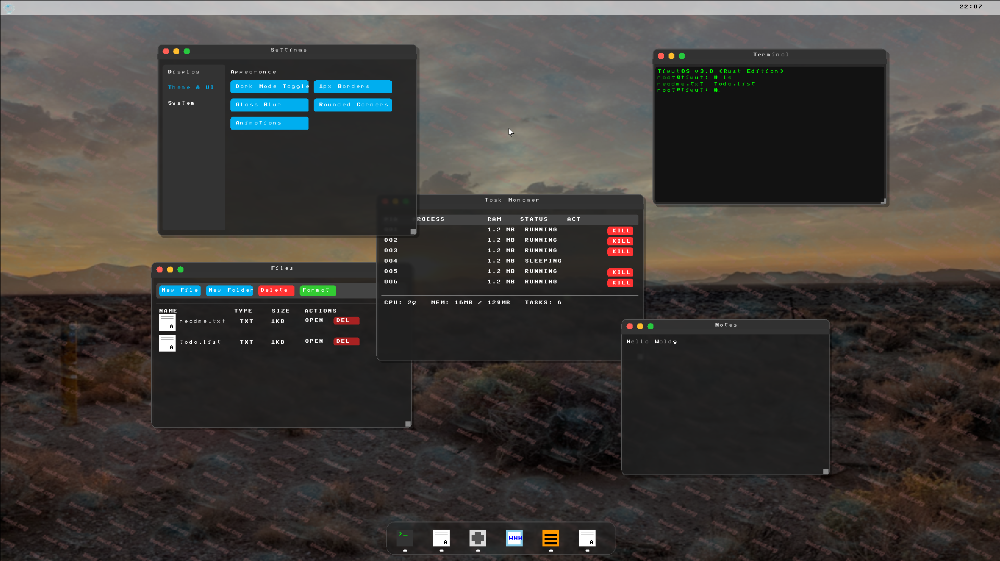

# TiwutOS
A custom, bare-metal operating system built entirely from scratch in C++, Rust, and Assembly. TiwutOS started as a simple "Hello World" kernel and has rapidly evolved into a fully graphical, network-capable environment with a hybrid architecture.

## Versions

TiwutOS has gone through major architectural changes. Check out the readmes for the specific versions:

### [v3.0 - Hybrid Rust/C++ Architecture](v3.0/README.md)
The most recent version of TiwutOS! It introduces a memory-safe **Rust kernel** intertwined with the C++ graphical user space. Features a stunning glassmorphism UI, a smart auto-hiding dock, dynamic HD/WQHD resolution scaling, a brand new Settings interface, and a fully functional File Manager manipulating the RAM filesystem.

### [v2.1 - Native Networking & Pure C++](C&CPP/v2.1/README.md)
The massive milestone that implemented a **native TCP/IP stack**. Capable of driving the RTL8139 network card to send raw ICMP Pings and resolve UDP DNS requests on the actual internet, completely bypassing the host machine. Features a 16:9 widescreen GUI and Mac-style overlapping windows.

---

## Current Status
- **"Hello World" Bootloader** -> Successful
- **Graphical Window Interface** -> Successful
- **Custom Native Networking Stack** -> Successful
- **Hybrid Rust Kernel Integration** -> Successful
- **64-bit Architecture Migration** -> In Development

## Build Requirements
- `nasm`
- `g++-multilib` (for 32-bit compilation on x64 systems)
- `xorriso` & `grub-pc-bin`
- `qemu-system-i386` (or `qemu-system-x86_64`)
- `rustup` with `nightly` toolchain (For v3.0+)